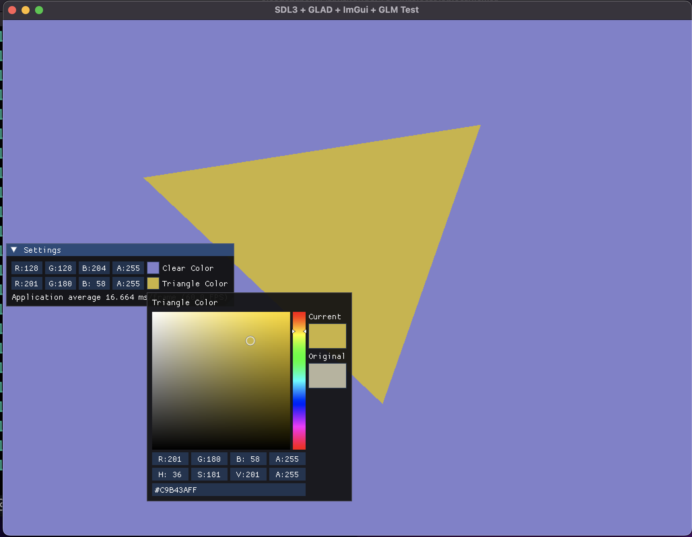

# CMakeSDL3OpenGL

Setup for SDL3 and OpenGL with Cmake.
All the libraries are **statically build**.
Includes main.cpp file to test the libraries and .gitignore for common ignores.
Should work crossplatform and multi-IDE. (not tested properly)
 
**Libraries:**
* SDL3
* GLAD
* glm
* ImGui

## Resources
All resource should be in the _resources_ folder. You can then access it with a macro **RESOURCE_PATH**. The _resources_ folder automatically copies to your build folder.
 
 
 

This setup is inspired by [@meemknight](https://github.com/meemknight) and his [Cmake video](https://www.youtube.com/watch?v=IBgfeZME2Vw).

